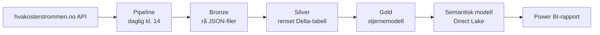

# Strømpris i Norge – ende-til-ende i Microsoft Fabric

Et komplett dataprosjekt i Microsoft Fabric som henter strømpriser for alle fem norske prisområder, bearbeider dem gjennom en medaljong-arkitektur og presenterer dem i en Power BI-rapport. Løsningen oppdateres automatisk hver dag.

## Arkitektur

## Datakilde

Spotpriser fra Nord Pool via det åpne API-et til [hvakosterstrommen.no](https://www.hvakosterstrommen.no). Timepriser per prisområde (NO1–NO5), uten mva. og nettleie. Datagrunnlaget starter 1. oktober 2025.

## Lagene

**Bronze** – `nb_01_bronze_strompris`
Henter rådata fra API-et og lagrer dem urørt som JSON i `Files/bronze/strompris/{område}/{år}/{mm-dd}.json`. Idempotent: filer som finnes, hoppes over. Startdato styres av en parameter fra pipelinen.

**Silver** – `nb_02_silver_strompris`
Leser alle JSON-filene og skriver Delta-tabellen `silver.strompris_time`:
- Prisområde hentes fra filstien
- Tidsstempler lagres både i UTC (entydig nøkkel) og lokal norsk tid
- Riktige datatyper (decimal for beløp)
- Duplikatfjerning på prisområde og tidspunkt
- Kvalitetskontroller: manglende verdier, negative priser og dager som ikke har 24 timer (sommertid gir 23 og 25 timer)

**Gold** – `nb_03_gold_strompris`
Stjernemodell i skjemaet `gold`:

| Tabell | Innhold |
|---|---|
| `fakt_strompris_time` | Én rad per prisområde per time |
| `dim_dato` | Hele kalenderår med norske måneds- og dagnavn |
| `dim_prisomrade` | NO1–NO5 med navn |
| `dim_time` | Timer i døgnet gruppert i tidsrom |

## Semantisk modell

`sm_strompris` bruker Direct Lake mot gold-tabellene, slik at rapporten leser dataene direkte fra OneLake uten import. Modellen har relasjoner med enkel filtrering, merket datotabell, sortering av tekstkolonner og skjulte nøkler.

DAX-mål blant annet: snittpris, høyeste/laveste pris, antall og andel timer med negativ pris, endring mot forrige måned, samt dyreste og billigste time i døgnet.

## Rapport

- **Oversikt:** nøkkeltall og prisutvikling per dag for alle prisområder
- **Døgnmønster:** snittpris per time og varmekart for ukedag × time

## Automatisering og drift

- Pipelinen `pl_strompris_daglig` kjører Bronze → Silver → Gold hver dag kl. 14, etter at morgendagens priser er publisert
- Bronze får en dynamisk startdato (siste tre dager)
- Arbeidsområdet er koblet til dette repoet med Fabric Git-integrasjon

## Funn (okt. 2025 – okt. 2026)

- Snittpris på 87,8 øre/kWh, med et spenn fra −34,6 til 410,9 øre
- 289 timer med negativ pris
- Nord-Norge ligger betydelig lavere enn resten av landet store deler av året
- Prisene er høyest på hverdager kl. 07–08 og 18–20, og lavest midt på dagen og i helgene

## Videre arbeid

- Prisprognose for neste døgn med maskinlæring
- Fabric data agent for spørsmål på naturlig språk
- Inkrementell lasting med `MERGE` ved større datamengder
- Deployment pipeline (dev → prod)
- Værdata fra Met.no for å forklare prisvariasjoner
